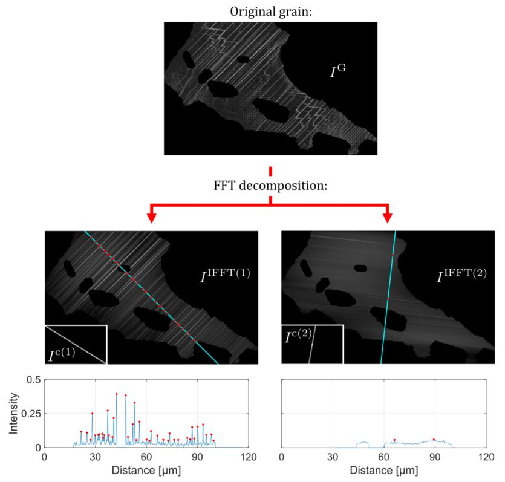
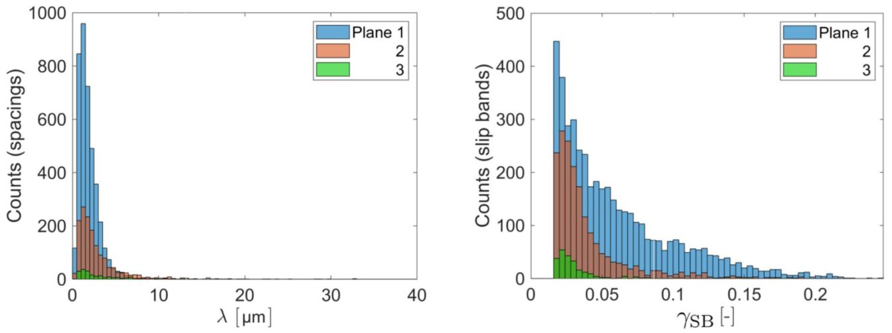

# Slip-bands-FFT-decompostion
Fast Fourier transform (FFT) decomposition to isolate and quantify the distribution of slip bands in a polycrystal from high resolution digitial image correlation (HR-DIC) and electron backscatter diffraction (EBSD) datasets. Other types of micrographs could be employed as long as slip bands are discernible.

## Requirements
Coded in Matlab R2021a with the image processing toolbox, signal processing toolbox and MTex toolbox (version 5.1.0).

## License
This repository is published under a GNU GPL v3 license (). See `LICENSE.txt` for full licensing information.

## Contents and how to use
**FFTdecomposition.m** - file used to run all the methodology. The user must initialize MTex (startup_mtex) and provide the following variables:
- ebsd: EBSD dataset in MTex format.
- I: cell with the binarized and greyscale versions of the HR-DIC dataset.
- Ith: values in strain that correspond to highest pixel intensity in each HR-DIC dataset (i.e. [Threshold for binarised image, Maximum strain in greyscale image]). 

The pixel coordinates in the EBSD dataset must match the coordinate system in the HR-DIC image. An example of such datasets is provided: **EBSD.mat** and **DICimages.mat**, these are smaller versions of the datasets used in the publication.

Run each section independently in the order they are provided. The main functions of this technique are:
* **fftd_preprocessing.m** - this takes the EBSD and HR-DIC datasets, already in the same coordinate system, and builds the appropriate binarized and greyscale images of individual grains.
* **fftd_decomposition.m** - FFT decomposition technique to determine the distribution of slip bands in very grain. This distribution is counted along lines that cross the centre of the grains perpendicular to the slip bands. The **fftd_decomposition_plots.m** can be used to generate relevant plots of this process for selected grains.
* **fftd_analysis_orientation.m** - function to optimise the EBSD orientation by minimising the difference between the trace angles predicted via EBSD and FFT decomposition.
* **fftd_analysis_counts.m** - function to calculate true slip band spacings and planar strains, numbers of grains, active slip planes, slip bands and slip band spacings counted.

## Example
The following image exemplifies the use of the technique in a Ni-based superalloy. The HR-DIC map of a grain is decomposed into two different images, each with the slip bands traces that share an individual orientation.

This allows for the quantification of slip band spacings and in-plane shear strains. The following histograms were obtained from 6557 slip bands detected over 365 grains.

More information can be found in the original publication.
